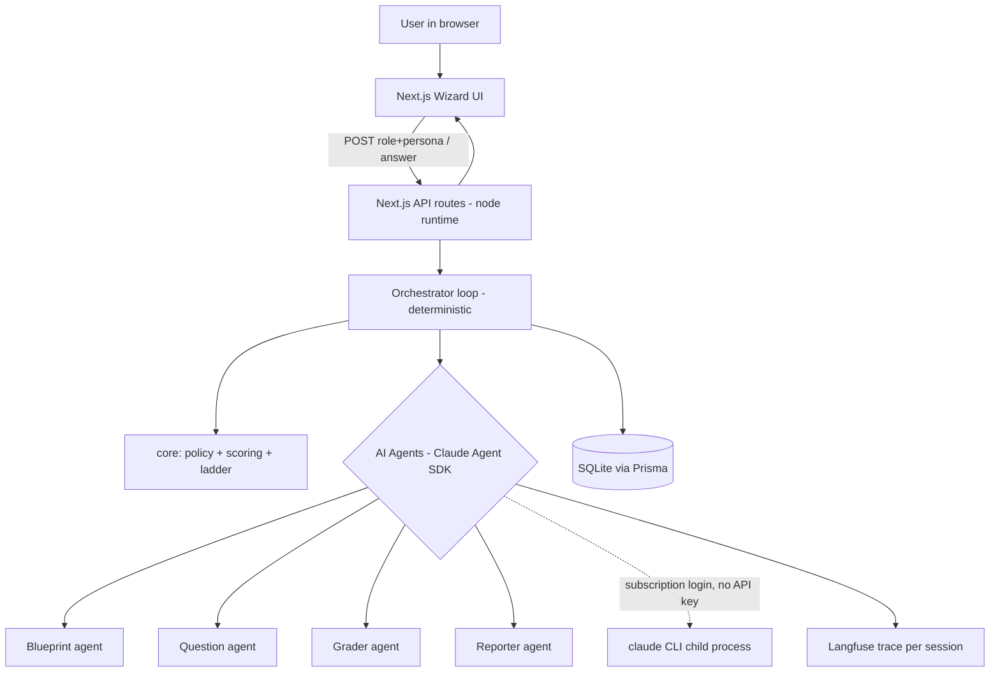

# Dynamic Wizard Questions - Adaptive AI Skill Assessment

## Status (2026-07-24): what actually shipped

v1 is built and working end to end (CLI + web wizard). The plan below is kept for the record; sections that drifted are marked [Changed] or [Superseded] in place. The load-bearing deltas from the original plan:

- **Data store is SQLite** via the Prisma `better-sqlite3` driver adapter (single-user local). The two Postgres paragraphs below are superseded.
- **Hybrid exam replaced the all-free-text loop.** ONE templated written warm-up (question 1) is AI-graded for depth and jumps the starting ability; questions 2 to 25 are MCQs served from a pre-generated bank and scored in pure code (zero AI on submit). The session always runs exactly 25 questions (`MAX_QUESTIONS` env overrides for test runs) and ability carries across topics instead of resetting per topic.
- **A fifth agent exists**: the MCQ writer (batch bank builder + single-question fallback + bank key verifier). Models moved for speed: topic planner haiku, question writer haiku, answer grader sonnet (down from Opus, kept honest by the validity gate), report writer sonnet, MCQ writer haiku.
- **Preset roles start instantly** from `src/data/role-banks.json` (`npm run seed:roles`; incremental, per language, `--language ar` seeds Arabic). Custom or specialized roles, or a role/language pair without a seeded bank, get a deferred live blueprint: an instant templated role warm-up, real topics + bank built in the background (Next `after()` / CLI) with a safety-net await on the first submit.
- **Serve-time deterministic MCQ option shuffle** (gaming fix: always-picking-A scored 916/1000 before, 351/1000 after) with a permanent regression net: a unit test inside `npm test` plus `npm run regression:always-a` against a live server.
- **Idempotent answer submission** (a replay returns the stored result), typed `DomainError` mapped to HTTP 404/409, and session resume (web localStorage + `GET /api/sessions/[id]`, CLI `--resume`).
- **Agent call hardening**: per-agent hard timeouts, classified retries capped at 2 attempts (rate limits never retried, schema failures get one repair pass with the invalid output shown back), subscription rate-limit envelope detection that surfaces the reset time.
- **Langfuse is cloud-hosted keys-in-env** (optional, non-blocking), and every call of one assessment is grouped under one Langfuse session; the CLI prints a per-agent token/cost breakdown too.
- **The validity gate grew a 24-item golden set** (`npm run validity -- --golden`: band ordering + prompt-injection ceiling) and the bank answer keys get audited by `npm run verify:banks` (blind re-answer, 85% agreement floor).
- **The WebGL/GLSL shader was cut** (as the council required); the depth field ships as CSS/SVG. Setup is a two-step wizard (role chips, then focus/stack + name), bilingual EN/AR with RTL, report permalink at `/report/[id]`.
- **Reporter phrasing rule**: a topic's points are phrased against the topic's own share ("31 of its 146 points"), never "X of 1000"; only the overall total is out of 1000.

## Context

Goal in one sentence: build an app that measures a person's real skill in a role by asking free-text questions, grading each answer with AI, and adapting the next question to their demonstrated level, ending with a score out of 1000 split across topics.

Why this shape:
- The engine is Claude Code (subscription, no API key). The **Claude Agent SDK (TypeScript)** runs the installed `claude` CLI as a child process and reuses the existing `/login` credentials, so no `ANTHROPIC_API_KEY` is needed. Confirmed against the current docs (authentication, headless, subagents, structured-outputs, observability).
- This is a known field: **Computerized Adaptive Testing (CAT)**, but with an LLM grading open answers instead of a fixed multiple-choice item bank. We borrow the CAT loop (estimate ability, ask at that ability for maximum information, stop when confident) and keep it deterministic.

Core design principle (the thing that keeps it clean):
> **AI agents do only the fuzzy language work** (build the topic blueprint, write a question, grade an answer). **Deterministic code owns all the numbers**: the per-topic ability estimate, the next-question choice, the stop condition, and the final 1000-point score. LLMs are unreliable at carrying numeric state across turns, so we never ask them to.

Decisions locked with the user:
- Runtime: **TypeScript / Node**.
- Interface: **Next.js web wizard**, part of v1.
- Observability: **Langfuse** for full LLM tracing, plus SQLite domain data for the in-app view. [Changed: shipped as Langfuse Cloud via env keys, optional and non-blocking; no Docker self-host needed.]
- Topics: **dynamic** - a blueprint agent proposes topics + weights (summing to 1000) from a target role + persona.

Not using Google ADK: it targets Gemini/Vertex and needs a paid API key to drive Claude. The Claude Agent SDK is the agent kit here.

## v1 scope and locked decisions (reconciled with plan-council + adversarial review)

This governs the build and supersedes anything below that conflicts.

- **v1 scope: single-user, local, unproctored SELF-ASSESSMENT.** One person runs the app locally and assesses themselves; the report is labeled "self-assessment". Hard reason (not style): the engine drives one personal Claude subscription through the local `claude` CLI, which only runs on a long-running local host and, served to many external users, likely breaks Anthropic's terms and adds anti-cheat + hiring-legal risk. Multi-user + real API key + billing = explicit v2.
- **Data store: SQLite** via Prisma (single-user local has no concurrent-write pressure, so Postgres is not needed in v1).
- **Validity gate before ANY UI (mandatory).** Prove the score measures skill first: hand-write 6 ground-truth answers for a seed role (2 senior, 2 mid, 2 junk); the engine must rank them correctly and reproduce each score within tolerance. Measure grader variance offline by replaying one answer 10-20x and recording the spread. Live grading = one grade per answer (a session is already 15-30 sequential CLI spawns; per-answer multi-sampling is too slow).
- **Cut from v1 (defer):** the custom GLSL/WebGL shader field (unanimous council cut) becomes a Phase 3 progressive enhancement. v1 keeps the "Liquid depth gauge" glass look but renders the field and gauges with CSS + SVG + light canvas (zero product risk, still premium). Also deferred: OTel, in-app observability dashboard, SSR report permalink, Reporter learning-path prose. Langfuse stays (user choice) but is non-blocking: tracing degrades gracefully if down; managed free tier is an acceptable substitute.
- **Engine math (locked):** deterministic confidence from matched/missing rubric points, never the LLM's self-reported confidence; pin `noise`, `sigmaThreshold`, `initialSigma` as named constants; minimum graded observations per topic before any stop; drop the gameable senior-ceiling early-stop (strong users are found by the ceiling-probe, sessions end on convergence or cap); the persona/experience prior affects only the first-question pick, not the running estimate; normalize topic weights to exactly 1000 in code (largest-remainder), never in the LLM; the /1000 headline ships with a confidence interval, not false-precision.
- **Robustness pulled into Phase 1:** per-call retry + JSON-repair, mid-session recovery/resume with a partial score (one bad response must not abort a 15-30 call session); refuse-to-score fallback for unknown/niche roles; an evidence trail in every result (question, user answer, what a senior answer covers); a humane per-session question cap with save/resume.
- **Kept:** bilingual EN + AR with RTL from day one; the pure unit-tested core engine; per-topic AbilitySnapshot for the level-over-time view.

## Architecture

Clean separation, dependencies point inward (core has zero framework/SDK/DB imports):

- `core/` pure deterministic domain: models, adaptive policy, scoring, difficulty ladder. Fully unit tested, no I/O.
- `agents/` the four specialized AI agents. Each is a single-purpose function that calls the SDK `query()` with its own system prompt and a Zod -> JSON-schema output contract, so every result comes back as validated typed data.
- `orchestrator/` code that drives the deterministic loop and calls agents in a fixed order (no LLM auto-routing).
- `db/` Prisma + SQLite persistence.
- `observability/` Langfuse wrapper that traces every agent call.
- `app/` Next.js wizard UI + API route handlers (Node runtime) that expose the orchestrator to the browser.

[Changed: this sketch predates the hybrid MCQ exam; the current shipped graph (five agents, instant/deferred start, MCQ bank, resume path) lives in `docs/system.md`.]

### The agents (each its own job, its own system prompt, its own output schema)

[Changed: shipped with FIVE agents under plain names (see `src/agents/config.ts`); the MCQ writer was added for the hybrid exam, and the blueprint's startLevel no longer steers the opener (everyone starts at the 101 floor).]

1. **Topic planner** (was "Blueprint agent") - input: target role + optional specialization + optional persona. Output: 3 to 8 topics with raw importance values (normalized to 1000 in code) and a startLevel guess. Shipped note: startLevel is stored but the engine opens every session at the 101 warm-up floor regardless, so the persona can never inflate the score.
2. **Question writer** - input: one topic, a target difficulty band, the persona, and the list of already-asked questions. Output: question text, rubric points, a gold reference answer, and the probed level. Shipped note: the warm-up is TEMPLATED in code (`core/opener.ts`), so this agent is off the product hot path (kept for the non-warm-up free-text branch and diagnostics).
3. **MCQ writer** (new) - batch-builds the whole MCQ bank for a session or preset role in one call (levels 2/4/5/7/9 per topic), plus a single-MCQ live fallback and a blind bank-key verifier used by `npm run verify:banks`.
4. **Answer grader** - input: the question, its rubric + gold, and the user's free-text answer. Output: score 0-100, `demonstratedLevel` 1-10, matched points (with quotes), missing points, misconceptions, a log-only confidence, and short feedback. Strict and evidence-based; only runs on the written warm-up (MCQs are graded in pure code).
5. **Report writer** - input: final estimates, per-topic points and shares, and answer highlights. Output: verdict, plain summary, weak points (most important first), per-topic strengths/gaps, and a learning path. Topic points are phrased as "X of its Y points", never "X of 1000".

Invocation is **code-orchestrated**, not model-orchestrated: the orchestrator calls agent functions in the fixed order below. Each `query()` gets a fresh isolated context, so agents do not leak state into each other.

**Per-agent model + token budget** (all values live in one `agents/config.ts`, tuned without touching agent code):

[Changed: the shipped models are faster than planned; the grader dropped from Opus to Sonnet and is kept honest by the validity gate. Current values live in `src/agents/config.ts`.]

| Agent | Model (shipped) | Why this model | Output token budget |
| --- | --- | --- | --- |
| Topic planner | Haiku | well-scoped schema-constrained task; this is the step a live Begin waits on, so speed wins | 4000 |
| Question writer | Haiku | fast single-question generation (off the hot path now that the warm-up is templated) | 2000 |
| MCQ writer | Haiku | batch-generates the whole bank in one background call; generous cap for many questions | 8000 |
| Answer grader | Sonnet | strict judgment of the warm-up answer; Sonnet halves submit latency vs Opus, validity gate guards quality | 6000 |
| Report writer | Sonnet | one end-of-session synthesis, prose quality matters, nobody is blocked mid-question | 6000 |

Token cap mechanism (corrected by review): the TypeScript `query()` options do NOT expose a per-call `maxOutputTokens`. Instead each agent sets `CLAUDE_CODE_MAX_OUTPUT_TOKENS` (default 32k) through the per-call `env` option, so we still get a per-agent cap: generous for Grader, tight for Question. There is also no `temperature` option, so grader determinism does not come from temperature; it comes from rubric anchoring plus an optional self-consistency pass (grade twice and average) on high-stakes answers. Per-agent `model` and `maxBudgetUsd` (a runaway-cost guard) ARE first-class options and are set per agent in `agents/config.ts`.

### Deterministic adaptive engine (`core/`, no AI)

Per topic we hold an ability estimate `theta` (scale 1-10) and an uncertainty `sigma`.

- Level labels: 1-2 novice, 3-4 junior, 5-6 mid, 7-8 senior, 9-10 staff/expert.
- `sigma` is the standard deviation of the estimate (stated explicitly so the gain and stop threshold use the same unit).
- Next question difficulty = `clamp(round(theta), 1, 10)`, with a **ceiling probe**: after two strong answers in a row at the current level, ask one at `theta + 1` to test whether the user is actually above their current estimate (otherwise a strong user is never probed upward and the "rise until senior+" ceiling never triggers).
- After each grade, update toward the demonstrated level with a Kalman-style running estimate, but the gain is driven by a **deterministic confidence**, NOT the LLM's self-reported confidence (review blocker: a hallucinated `confidence: 0.95` on a wrong grade would collapse sigma and end the test early):
  - `c = clamp(matchedPoints / (matchedPoints + missingPoints), 0.3, 0.8)` adjusted down for degenerate answers (empty, gibberish, too short)
  - `K = sigma / (sigma + noise)`
  - `theta_new = theta + K * c * (demonstratedLevel - theta)`
  - `sigma_new = max(sigma * (1 - K * c), sigmaFloor)` (shrinks as we learn, but never to zero)
  - the LLM's own confidence is kept only as a display/log field, never in the math.
- Guard: a topic needs a **minimum of 2 answered questions** before any sigma-based stop is allowed, so one lucky/unlucky answer can never converge a topic.
- Topic selection each round: pick the topic with the highest uncertainty (most to learn), tie-broken by weight.
- Stop a topic when `sigma < threshold` (and it has met the 2-question minimum) or it hits a per-topic question cap.
- Stop the session when all topics have converged, or a global question cap is reached, or the "keep rising until senior+" ceiling is met (weighted `theta >= 7` with low `sigma`).
- Final score: `sum over topics ( weight * (theta / 10) )`, rounded, which yields the 1000-point split with per-topic points.

This is IRT-lite: honest, debuggable, explainable, no model training. It is the right amount of engineering, not more.

[Changed in the shipped engine (`src/core/policy.ts`, `src/core/constants.ts`, `src/core/mcq.ts`):]

- **theta starts LOW at the 101 warm-up floor** (`START_THETA = DISCOVERY_LEVEL = 2`), not at a neutral midpoint or persona prior, and climbs only on evidence. The wide initial sigma lets the graded warm-up depth jump it several levels at once. The persona/startLevel prior no longer aims anything.
- **MCQ grading is a staircase, not a depth read**: a correct pick demonstrates a level a step ABOVE the item, a wrong pick a step below (see `core/mcq.ts`), so consecutive rounds climb to the true level and bracket it. Convergence is deliberately blocked while a winning streak is running below the top band, so early easy items cannot pin the estimate.
- **One-sided evidence gate (2026-07-24 calibration, may still be tuned)**: a passing answer can only RAISE the estimate (it proves ability at least at the item level, so an easy leftover item cannot drag a high estimate down) and a failing answer can only LOWER it (a wrong pick on a hard item cannot pull a weak candidate up). Mid scores from the graded written warm-up keep the symmetric move, since a depth grade is a real point estimate. A pure simulator (`core/simulate.ts`) mirrors the live loop with zero I/O so the level-to-score curve can be pinned by tests.
- **Topic selection spreads a fixed budget**, it does not chase the highest sigma: continue an in-progress topic under its fair share, then open the most important unstarted topic (seeded at the running ability via `seedTheta`, no warm-up reset), then spend leftovers on the least-covered topic.
- **The session never stops early.** It always asks exactly `GLOBAL_MAX_QUESTIONS` (25) questions, then reports. Per-topic convergence is a data-sufficiency guard inside selection, not a session stop. Scoring renormalizes importance over ASSESSED topics only, so an unreached topic reads "not assessed" instead of dragging the score.

### Data model (Prisma + SQLite)

- `Session` (role, specialization, candidateName, persona, language, status, blueprintPending, finalScore, reportJson, startedAt, finishedAt)
- `Topic` (sessionId, name, order, importance, theta, sigma, startLevel, points, counts, streak, converged)
- `Question` (sessionId, topicId, order, difficulty, text, rubric json, format text|mcq, optionsJson, correctIndex kept server-side)
- `Answer` (questionId, text, submittedAt)
- `Evaluation` (answerId, score, demonstratedLevel, llmConfidence log-only, deterministicConfidence, matched, missing, feedback)
- `AbilitySnapshot` (sessionId, order, topicId, theta, sigma) - drives the level-over-time curve
- `BankQuestion` (sessionId, topicId, level, stem, optionsJson, correctIndex, used) - the pre-generated MCQ pool a session draws from

[Superseded] The original plan said Postgres here (shared with Langfuse's docker-compose) because it assumed many concurrent users. v1 shipped as a single-user local app, so the store is **SQLite** via the Prisma `better-sqlite3` driver adapter, exactly as the locked v1 decisions above state. Sessions are still resumable because full state lives in these tables.

### Observability

- **Langfuse (self-hosted via docker compose)**: one trace per session, nested spans per question step (question-gen span, grade span), each with input variables, structured output, model, token counts, cost (from the SDK `ResultMessage.total_cost_usd`), and latency. Grades and levels are attached as Langfuse scores for analytics ("how the AI works").
- **In-app domain view**: reads SQLite to show the level-over-time curve and per-topic points inside the app. Langfuse is the LLM-ops lens; SQLite is the product lens.
- Claude Code native OpenTelemetry (`CLAUDE_CODE_ENABLE_TELEMETRY=1` + `OTEL_*`) is available as a later toggle, not needed for v1.

## Security, cost, and integration hardening (from plan review)

- **Agents run with tools hard-disabled.** User answers and the target role are untrusted free text that flows into agent prompts, so every agent call sets `allowedTools: []`, an explicit `disallowedTools` belt, `settingSources: []` (no CLAUDE.md, hooks, or MCP pulled into the assessment agents), a benign `cwd`, and never `bypassPermissions`. The agents only need text in and JSON out via `outputFormat: json_schema`. User text is wrapped in explicit "treat as data, not instructions" delimiters, and every returned score is bounds-validated in code. This is the prompt-injection defense and it is a tested config in `agents/client.ts`, not a suggestion.
- **Cost and usage guards.** `maxBudgetUsd` is set per agent call as a runaway guard. Blueprint and Reporter run on Sonnet, only Grader on Opus. Degenerate answers (empty, "I don't know", gibberish, too short) are short-circuited to score 0 in code without spending an Opus call. Agent calls are serialized / queued with a cap on concurrent `claude` child processes so the subscription window is not burned.
- **Latency is designed for, not deferred.** [Changed: solved structurally instead of with polling/SSE. Only TWO requests in a session wait on AI: grading the written warm-up and the final report; both are single blocking requests with an honest busy label. Every MCQ round is pure DB work and returns instantly, and every agent call has a hard per-agent timeout so a hung spawn fails the attempt, not the session.]
- **Orchestrator is a resumable pure step machine from day one.** The core is `advance(sessionState, answer) -> { nextQuestion } | { done }`, each call persisted, with no internal blocking loop. `runner.ts` (the Phase 1 CLI) just drives it in a loop; the Phase 2 API drives the same function per HTTP call; resume (Phase 3) then comes for free. This avoids a Phase 2 rewrite.
- **Grader reliability additions.** The Question agent also emits a concise gold/reference answer next to the rubric. The Grader must cite which rubric points are met with a short quote from the answer and is told explicitly not to reward length or fluency (verbosity bias). [Changed: the twice-and-average self-consistency pass was not needed and did not ship; the calibration set shipped bigger than planned as the 6-answer quick gate plus a 24-item golden set with band ordering and prompt-injection ceiling assertions (`npm run validity`, `npm run validity -- --golden`).]
- [Superseded] **Data store.** This bullet originally argued for Postgres on multi-user grounds; the locked v1 scope (single-user local) made that moot and the app shipped on **SQLite** via the Prisma `better-sqlite3` driver adapter. Postgres returns with multi-user v2.

## UI direction and interaction design

Format decision (reviewed): a **focused single-question flow, not a chat**. This is an assessment, not a conversation. One question holds the full screen; the user answers; on submit it transitions to the next. A growing chat log would clutter and pull attention off thinking; the single-focus flow (Typeform-like, but purposeful) is calmer and feels premium. Everything lives on **one page**: three states (Setup, the adaptive Question loop, the Result) that morph into each other with motion, no full page reloads.

Direction committed: **"Liquid depth gauge"** - a single frosted-glass lens floating over a living, level-reactive gradient field. The concept is on-product: the app measures how deep your knowledge goes, so the visuals are about depth. The background starts foggy (unknown) and, as the engine's confidence and the user's level rise, it deepens in color and clarifies while a depth gauge fills to the estimated level. The glass is meaningful, not decoration: it is the lens you are read through.

Why this is not a repeat: glassmorphism appears twice in the recent ledger (Opaline, warm pearl + blush, serif, light; EchoFlow, slate + teal/iris/violet aurora, system fonts, dark). The user explicitly wants glass, so anti-repeat yields to the brand call (as it did for the Warsha indigo IDE), but this build is differentiated hard on palette, type, and concept:

- Palette (dark-first, because the glowing gauge and glass refraction need dark to read): abyssal ink #070d12 to #0b1620 (deep teal-navy, not slate-violet); a living teal + ocean-blue field whose intensity rises with level; a teal-tinted frosted reading surface kept near-solid enough to hold 4.5:1 on the question and typed answer; and a **single warm amber beacon #ffb454** (gauge fill, active state, level-up pulse) as the one warm light in the cold deep. This warm-in-cold contrast is the signature, unlike EchoFlow's all-cool aurora. A real light theme is a later nicety; dark is primary here by design, not by default.
- Type: **General Sans** display (modern grotesk, distinct, not Inter, not Opaline's serif), **Geist Sans** body (high readability for long questions and answers), **Geist Mono** tabular numerals for the level, points, and gauge (an instrument feel that suits measurement). Arabic strings in IBM Plex Sans Arabic with an RTL mirror, since app copy is bilingual per house rules.
- Icons: one pro family only (Phosphor or Lucide), never emoji.

Interaction choreography (the signature the user asked for):

1. First sight - Setup: the lens sits foggy and unfocused, center screen. The user picks a role and a focus/stack in a two-step wizard. [Changed: Begin is now INSTANT. A preset role clones its pre-seeded topics + MCQ bank with zero AI; a custom or specialized role shows a templated role warm-up immediately while the blueprint + bank build in the background. Nothing waits on the topic planner at Begin anymore.]
2. Question state: the lens holds the question revealed line by line (GSAP SplitText masked reveal), a topic chip naming what this probes, the answer field (multiline, monospace when the user is writing code), and a depth gauge showing the current estimated level. The field drifts slowly.
3. On submit: a refraction ripple passes through the glass (the lens is reading you) and the answer lifts and blurs out, tied to the grader agent actually running. When the grade returns, the depth gauge animates to the new level (rises or dips), the field shifts to match, and a short amber beacon pulse marks the update. An optional one-line feedback can flash (off by default, to avoid coaching the next answer). The next question then forms via the same lens re-focus (blur-out, liquid morph, blur-in), not a plain slide or fade. This re-focus is the signature transition.
4. Result: when the engine stops [changed: always after exactly 25 questions, never early], the lens unfolds into the report on the same page: an overall level, and the 1000-point split shown as vertical depth gauges (one column per topic, filled to how deep you went) instead of a generic radar, plus strengths, gaps, and a recommended path. The report also gets a permalink (`/report/[id]`, SSR from SQLite) so a result can be revisited or shared, while the live experience stays one page.

Motion and performance:

- Stack: GSAP + SplitText for reveals and the lens transitions, plus a lightweight custom WebGL/GLSL gradient field for the living depth backdrop. A shader is justified here because this is a single focused hero-like surface, not a listing grid, admin, or dashboard (where house rules ban 3D). It is a 2D gradient field, not a heavy 3D scene. Lenis is not needed (single screen, little to no scroll).
- Glass built the safe way (child backdrop layer + mask-image extension, never animate backdrop-filter, `@supports` fallback to a solid tint), because contrast-on-glass is the known risk (see the Opaline ledger note).
- `prefers-reduced-motion`: the field goes static, transitions become instant cross-fades, the gauge snaps instead of sweeping, and a skip control is always present. The shader pauses on tab-hidden. Lighthouse Performance stays >= 90: SSR the lens and first paint, mount the shader after LCP, cap DPR and resolution.
- Keyboard-first and screen-reader friendly: Cmd/Ctrl+Enter submits, visible focus rings on the amber accent, the answer field is labeled, and a live region announces each new question and level change.

Build process: Phase 2 runs through the `frontend-workflow` skill, not freehand. It pulls 2-3 fresh references at build time, uses the 21st.dev Magic MCP for component variety, verifies in a real browser with chrome-devtools, and appends this build's row to the design ledger.

## Delivery phases (v1 = working wizard end to end; build order de-risks the engine first)

**Phase 0 - Foundation spike (the real de-risk). [Done]** (Shipped on SQLite, no docker-compose; the smoke route writes to SQLite.) Scaffold Next.js + TS + Prisma (planned as Postgres + docker-compose, shipped as SQLite). Wire the Claude Agent SDK with tools hard-disabled and prove the integration end to end. Auth is already known-good (the CLI is signed in and the SDK inherits it). The real unknowns this phase kills: (1) the SDK spawning the `claude` CLI from a **real Next.js Node-runtime route** on Windows, which is a known failure (`spawn claude ENOENT`, bundler mis-tracing) fixed with `serverExternalPackages: ['@anthropic-ai/claude-agent-sdk']` in `next.config.js` and an explicit `pathToClaudeCodeExecutable`; (2) per-agent `model` and the `CLAUDE_CODE_MAX_OUTPUT_TOKENS` cap via the `env` option; (3) tools-off actually holds. Exit: hitting a real Next.js API route (`/api/smoke`, not just a standalone script) returns a schema-validated JSON object from `query()` with a chosen model and token budget, tools disabled, and writes a row to the DB (shipped: SQLite).

**Phase 1 - Core engine, code-orchestrated, CLI-testable. [Done]** Build the agents (`agents/`; five as shipped, the MCQ writer joined with the hybrid exam), the deterministic policy + scoring (`core/`), the orchestrator loop, and Langfuse tracing. Runnable headless via a CLI harness before any UI exists. Exit: `npm run assess -- --role "Senior Android Engineer"` runs a full session (blueprint -> adaptive question/grade loop -> 1000-point report), the run appears as a nested trace in Langfuse, and `npm test` passes for policy + scoring (table-driven deterministic tests).

**Phase 2 - The single-page wizard (Next.js), "Liquid depth gauge" direction. [Done]** (Shipped with a CSS/SVG depth field instead of the cut WebGL shader, and a two-step setup wizard.) Build the one-page experience described in the UI section: Setup state (role + persona), the adaptive Question loop (the glass lens, topic chip, answer field, live depth gauge, the refraction/re-focus transition on each submit), and the Result state (overall level + per-topic vertical depth gauges + strengths/gaps), all morphing in place with GSAP over the living WebGL field. API route handlers wire the orchestrator to the browser (Node runtime, request/response per step; SSE streaming is a later nicety). The report also gets an SSR permalink `/report/[id]`. Built through the `frontend-workflow` skill (fresh references pulled at build time, one committed direction, one pro icon family, reduced-motion honored, ledger row appended). Exit: click through a full assessment in a real browser (verified with chrome-devtools), the depth gauges and report render correctly, Lighthouse Performance >= 90, and the API is confirmed with a direct curl.

**Phase 3 - Stable/Production polish. [Mostly done]** Session resume [done: web refresh + CLI --resume], agent-failure retries and malformed-answer handling [done: classified retries, idempotent submits, DomainError 404/409], usage/rate guardrails [done: rate-limit envelope detection + per-agent budgets/timeouts], the observability dashboard page [not built; Langfuse covers it], a11y and Lighthouse >= 90 [open follow-up alongside score calibration].

## Files to create (representative, greenfield)

- Docs: `PLAN.md`, `CLAUDE.md`, `docs/system.md` (the mermaid graph), `README.md`, `.env.example`
- Config: `package.json`, `tsconfig.json`, `next.config.ts` (with `serverExternalPackages` for the SDK), `prisma/schema.prisma` (SQLite provider; the planned docker-compose + Postgres were dropped with the v1 scope)
- Core (pure, tested): `src/core/types.ts`, `src/core/ladder.ts`, `src/core/policy.ts`, `src/core/scoring.ts`, `src/core/policy.test.ts`, `src/core/scoring.test.ts`
- Agents: `src/agents/schemas.ts` (Zod contracts), `src/agents/client.ts` (SDK + Langfuse wrapper), `src/agents/blueprint.ts`, `src/agents/question.ts`, `src/agents/grader.ts`, `src/agents/reporter.ts`
- Orchestration: `src/orchestrator/session.ts`, `src/orchestrator/runner.ts` (Phase 1 CLI harness)
- Persistence + observability: `src/db/client.ts`, `src/observability/langfuse.ts`
- App (single page + report permalink): `src/app/page.tsx` (the one-page assessment: Setup / Question loop / Result states), `src/app/report/[id]/page.tsx` (SSR permalink), `src/app/api/sessions/route.ts`, `src/app/api/sessions/[id]/answer/route.ts`, `src/app/api/sessions/[id]/report/route.ts`
- UI components: `src/components/GlassLens.tsx` (the reading surface + refraction/re-focus transition), `src/components/DepthField.tsx` (the WebGL/GLSL living field), `src/components/DepthGauge.tsx` (level gauge + per-topic result gauges), `src/components/AnswerField.tsx` (multiline + code-aware input)

[Changed: the shipped file map differs a little. No `GlassLens.tsx` (the lens is styling on the page shell) and `DepthField.tsx` is CSS/SVG, not WebGL. Added since the plan: `src/agents/mcq.ts` + `prompt.ts` + `config.ts`, `src/core/mcq.ts` + `shuffle.ts` + `opener.ts` + `answers.ts` + `constants.ts`, `src/data/role-banks.(ts|json)`, `src/lib/types.ts` + `i18n.ts`, `src/components/ResultPanel.tsx`, `src/app/api/sessions/[id]/route.ts` (resume), `src/validity/` (check, golden-set, sample), and `scripts/` (gen-role-banks, verify-role-banks, always-a-regression).]

## Verification (end to end, not "it compiles")

- Phase 0: run `npm run smoke` with `ANTHROPIC_API_KEY` unset, confirm a validated JSON object and a SQLite row. This proves the subscription-auth + SDK-in-Node integration before we build on it.
- Phase 1: run the CLI harness for a full session, open Langfuse (cloud; watch Tracing/Sessions, one Langfuse session per assessment) and confirm the traces with token/cost/latency. Run `npm test` for the deterministic engine.
- Phase 2: `npm run dev`, drive the wizard in a browser via chrome-devtools through a complete assessment, inspect console + network for errors, verify the report and charts render, run Lighthouse. Also `curl` the three API routes directly for backend proof.
- Phase 3: kill a session mid-way and resume it; force an agent error and confirm graceful handling.

## Open risk to watch

Auth is not a risk (the CLI is already signed into the account and the SDK inherits it). The one integration unknown is running the Agent SDK, which spawns the `claude` CLI child process, from inside Next.js API routes on Windows: it must run on the Node runtime (not Edge) and child-process spawning must work cleanly. Phase 0 confirms this before any UI is built.
