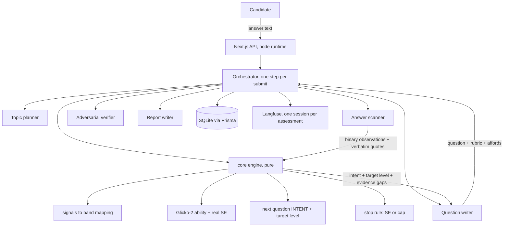

# PLAN v2: from question bank to a fully AI-driven adaptive interview

Status: proposal, not built. v1 (shipped, see `PLAN.md`) stays running behind a flag until v2 passes its validity gate.

Measurement spec this plan implements: `docs/research/answer-level-signals.md`. Read that first; it is the evidence base and it defines every signal named here.

## 0. Reshape after adversarial review (2026-08-01)

The first draft of this plan was reviewed against the actual code and came back RESHAPE FIRST. Six changes, each verified against a file:

1. **Speculative pre-generation is cut.** `orchestrator/session.ts:1148` serves any unanswered row at `order = totalAnswered + 1` and `prisma/schema.prisma:77` has no unique constraint on `(sessionId, order)`, so writing several candidate questions at one order lets resume serve a different question than the one submit graded. The latency win was not worth a correctness hole in the resume path.
2. **Glicko-2 is cut. The existing Kalman update stays.** The code being replaced is not Elo, it is already a one-dimensional Bayesian filter whose sigma is a real posterior standard deviation on the same 1..10 scale `core/scoring.ts:71` uses for the confidence band. Glicko-2 would estimate a volatility parameter from two to four observations per topic, which is noise, and its rating deviation lives on a different scale, which would silently break that band. Only the **measurement feeding the filter** changes: a band read instead of an MCQ staircase.
3. **The question's decision is persisted, never re-derived.** `getSessionState` currently re-runs `decide()` to rebuild the `ceilingProbe` and `discovery` flags (`session.ts:1362`). That only works because `decide()` is pure over persisted state. The new loop carries an intent and an affordance list, so those go on the `Question` row and resume reads them.
4. **Mode and length become session columns.** `GLOBAL_MAX_QUESTIONS` is read at module load (`core/constants.ts:43`) and reported as `totalQuestions`, so an env flip would change the length of in-flight sessions. `Session.mode` and `Session.maxQuestions` land before the flag is used.
5. **All anti-cheat is struck.** The user cut it on 2026-08-01. `core/validity.ts`, the `ValidityFlag` table, rapid-guess timing, paste-signature checks and the report's validity note are removed from scope. The own-words probe stays, as a measurement device.
6. **A refactor slice comes first.** Extracting a grade-pipeline seam out of `submitAnswerOnce` (`session.ts:898-1050`) is its own commit with tests unchanged, so the feature slice is not a big-bang edit of a 1400-line file.

Everything below reflects these decisions.

---

## 1. The goal in one sentence

Turn the app from a pre-generated multiple-choice bank into a live agent-to-agent interview where every question is written for this candidate in this moment, every answer is scanned for the signals that actually reveal level, and the session ends with a diagnosis a developer can act on, not a percentile.

## 2. What is wrong with v1, stated plainly

v1 works and is well engineered. The problem is what it measures.

1. **MCQ measures recognition, not reasoning.** A 4-option item has a 25 percent guessing floor and rewards elimination tactics. We already learned this the hard way: unshuffled banks let an always-A robot score 916 out of 1000.
2. **A bank cannot adapt below item granularity.** The engine can pick a harder item; it cannot ask "you said the cache is write-through, what happens on a cold start". The interesting signal lives in the follow-up, and a bank has no follow-ups.
3. **The written warm-up is the only real measurement, and it fires once.** 24 of 25 items contribute a single bit each. One graded open answer carries roughly two to four times the information of a dichotomous item (`docs/research/answer-level-signals.md` section 1), so v1 spends 24 rounds gathering less signal than 6 good open answers would.
4. **The report can only say what you got wrong, not why.** There is no artifact of reasoning to diagnose. Users of every competing product complain about exactly this.
5. **Template banks force a role and language pair to exist ahead of time.** Custom roles get a worse product.

`Assessment` The one thing v1 gets right that v2 must not lose: **deterministic code owns every number.** v2 keeps that law and pushes harder on it. The agents get *more* language work and *zero* extra arithmetic.

## 3. What v2 is

A five-agent interview loop with a deterministic engine in the middle.

### The five agents

| Agent | Job | Model | On hot path |
| --- | --- | --- | --- |
| **Topic planner** | Role plus focus into 3 to 5 weighted topics. Unchanged from v1 except fewer topics (a 12-question session cannot honestly cover 8). | haiku | Background only |
| **Question writer** | Writes ONE question given: topic, target band, question **intent** (chosen by code), the evidence axes still missing, the candidate's own last answer when the intent is a probe, and everything already asked. Returns question text, rubric points, gold reference, and `affords` (which signal axes this question makes it possible to show). | sonnet | Yes, speculatively pre-generated |
| **Answer scanner** | The heart. Two parallel calls per answer: (a) rubric coverage, (b) level signals across the seven axes. Emits **binary MET / UNMET / CANNOT_ASSESS per criterion with a verbatim quote**. Never emits a level, a score, or a number. | haiku for the per-axis calls | Yes |
| **Adversarial verifier** | Gate, not a rescorer. Runs only on borderline or high reads. Tries to refute matched observations: is the quote really evidence, is the claim actually correct, is this recitation, is this an injection. Can only lower a band or force abstention. | sonnet | Conditional |
| **Report writer** | Final synthesis: verdict, per-topic diagnosis quoting the candidate's own words, ranked gaps, and a learning path built from a curated resource map. | sonnet | End only |

**Deleted:** the MCQ writer, the bank builder, the bank verifier, the role bank seed data, the option shuffler, the always-A regression, and the `BankQuestion` table.

### The deterministic core, all pure and unit-tested

- `core/signals.ts` **new**. The seven axes as typed data plus the observations-to-band mapping from the research doc: base from SOLO structure, at most two promotions, then hard caps, then the affordance gate. This file is the product's opinion, expressed as code, and it is where every tuning decision goes.
- `core/policy.ts` **kept, with one change**. The Kalman update stays exactly as it is: `theta_new = theta + K * c * (demonstrated - theta)`, `sigma_new = sigma * (1 - K * c)`, sigma on the same 1..10 scale the report's confidence band already consumes. What changes is the **measurement**: `demonstratedLevel` now comes from `readBand()` rather than the MCQ staircase, and the deterministic confidence `c` comes from how much of the rubric was matched plus how many axes the question afforded. The one-sided evidence gate (`policy.ts:71`) is removed: it existed to patch a bank artifact where an easy leftover item dragged a high estimate down, and with no bank there are no leftover items.
- `core/intent.ts` **new**. Chooses the next question's *intent* (see section 5) from what evidence is missing, the current band, and how many rounds are left. Code picks the intent; the agent only writes the words. Any tie-break randomness is seeded on `(sessionId, order)`, the same trick `core/shuffle.ts` already uses, so the choice stays reproducible on replay.
- `core/scoring.ts` kept, extended to output **band plus interval** as the headline, with the 1000-point split kept as the number the user asked to keep. Unassessed topics stay "not assessed", never a zero.
- **No early stopping in v2.** The session runs a fixed 12 questions. Standard error is computed and reported as a readout, not used as a stop condition. Reason: `computeFinalScore` renormalizes importance over assessed topics only (`scoring.ts:46`), so a session that stopped at 8 items with 2 topics assessed would produce a 1000-point total that is not comparable to a 12-item one. A variable-length score and a fixed headline number cannot both be honest, and the user kept the number.
- **No `core/validity.ts`.** Anti-cheat is out of scope by the user's decision.

## 4. The question flow the user asked for

**Q1, the wide-aperture opener.** Templated per role, no AI call, so it shows instantly. It is deliberately mid-difficulty and answerable by anyone at any level. The trick is not in the question, it is in the reading: this one question affords all seven axes, so a novice answers it in three sentences of definition and a staff engineer answers it with a scoped assumption, a mechanism, a tradeoff, a failure mode and a number. One scan of that answer places the candidate within about one band, which is what the whole first-question design is for.

**Q2 onward.** Every question is generated live, targeted at the current band, with an intent chosen by code. There is no bank, no fallback bank, and no pre-seeded role data.

**Ending.** A fixed 12 questions, stored per session in `Session.maxQuestions` so a running session keeps its length even if the default changes. `Confirmed` 6 to 12 well-graded open-ended items is the realistic floor for placing someone into about 5 bands with acceptable reliability; PROMIS reaches reliability above 0.90 for 92 to 96 percent of respondents with CAT or a 6 to 8 item short form, and only 25.6 percent with 4 items. Going from 25 items to 12 is not a cut, it is a correction: 24 MCQs carried less information than 11 graded open answers will.

## 5. Question intents, and why code picks them

The engine holds a per-topic evidence ledger: which axes have been observed, which are still unknown. It picks the intent that closes the biggest gap at the right difficulty.

| Intent | Purpose | Fires when |
| --- | --- | --- |
| **Wide-aperture opener** | Place the candidate fast, affords every axis | Question 1 only |
| **Own-words probe** | Quote a phrase from their previous answer and ask them to go one level deeper. Also the strongest anti-paste defense we have | After a strong or a suspicious answer |
| **Tradeoff fork** | Two viable options, pick one and justify. Targets C4 and C5, the mid-to-senior boundary | Band 3 to 4 boundary, C axis unobserved |
| **Failure and recovery** | What breaks, how you would know, how you recover. Targets the D axis, the strongest senior discriminator | Band 3+, D axis unobserved |
| **Constrained scenario** | Ambiguous requirements plus constraints, asks for a design. Absorbing ambiguity is the axis every industry ladder actually measures | Band 4+ |
| **Experience anchor** | "A time in your own work when this broke." Grades specificity of the incident, not correctness | Band 3+, concreteness axis unobserved |
| **Premise challenge** | A question carrying a subtly wrong premise, or an "always use X, right?" framing. An expert reframes or rejects it; a novice complies. This is the user's "tricky question" idea generalized | Band 4+, testing for A4 and D5 |
| **Floor check** | One clearly easier question after two weak answers, to separate "does not know this topic" from "had a bad round" | Two consecutive weak answers |

`Assessment` This table is the product. Every competitor either serves a fixed item or lets a model free-run the conversation. Choosing the intent in deterministic code and the wording in an agent is what makes this both adaptive and reproducible.

**Affordances are derived in code, not declared freely.** Each intent carries the affordance set it can legitimately elicit (a failure-and-recovery question affords `failure`; a definition question does not afford `conditionality`). The question writer may only **narrow** that set, never widen it, and the narrowing is validated before the question is persisted. Left as free self-declaration, over-declaring would silently cap a fair answer and under-declaring would silently remove every cap, and neither would be visible in the score.

Two safeguards from the CAT literature, both cheap:
- **Randomesque selection**: pick among the top few candidate intents rather than always the argmax, with the tie-break seeded on `(sessionId, order)` so replay and resume reproduce it exactly. `Confirmed` Pure maximum-information selection is "rarely used in operational CAT" because it is greedy; in one simulation it administered only 30 of 300 pool items ([PMC5968224](https://pmc.ncbi.nlm.nih.gov/articles/PMC5968224/)).
- **Early-round stability**: information-based selection is unstable in the first few items. The first three questions follow a fixed opening ladder (opener, own-words probe, tradeoff fork) instead of chasing the estimate.

## 6. Grading a single answer, step by step

1. **Normalize.** Strip markdown, collapse whitespace, cap length for the prompt. `Confirmed` Style and markdown bias measures 0.76 to 0.92, roughly 20 times the size of position bias, and is the least-mitigated bias in practice ([arXiv:2604.23178](https://arxiv.org/abs/2604.23178)).
2. **Short-circuit degenerate answers** in code, exactly as v1 does. No agent call.
3. **Scan, two parallel calls.** Coverage against the rubric, and level signals across the seven axes. Each criterion returns MET, UNMET, or CANNOT_ASSESS, plus a verbatim quote and a one-sentence reason. `Confirmed` Per-criterion binary decomposition moves inter-evaluator Krippendorff alpha from 0.09 to 0.48 on average and cuts score variance from 0.0100 to 0.0019 ([arXiv:2603.00077](https://arxiv.org/html/2603.00077)). Separate calls beat batched criteria, which skew toward "yes" through confirmation bias inside one conversation.
4. **Verify quotes in code.** Every quote must be an exact substring of the normalized answer. A failed match discards that observation before it can earn credit. No model is involved in this check.
5. **Map to a band, in code.** `core/signals.ts`, per the research doc. Deterministic, testable, explainable.
6. **Adversarial verify, conditionally.** Runs when the read lands at band 4 or above, which is where a false positive is most expensive and where an over-generous read would inflate the headline. It may lower a band or force abstention, never raise one. `Confirmed` Debate helps error detection by +27.4 points F1 while hurting generation ([arXiv:2606.02866](https://arxiv.org/abs/2606.02866)).
7. **Update ability, in code.** The existing Kalman update, fed by `readBand().demonstratedLevel` and a deterministic confidence from rubric coverage. No new estimator.
8. **Persist** the observations, the quotes, the band, the ability, and the snapshot, in one transaction. Every one of these is later shown to the user as evidence.

Note on the one-sided evidence gate from v1: it was a patch for a bank artifact (an easy leftover item dragging a high estimate down). With no bank and a real Bayesian update carrying its own uncertainty, the gate is removed. Its removal is covered by the calibration tests.

## 7. The report, which is half the product

The competitor scan found the same hole in every product: they all rank, none diagnose, none admit uncertainty, and the candidate is never the customer. That hole is the opportunity.

The report ships with:

1. **A band with an interval**, plus the words for it. "Senior, high confidence" or "Between mid and senior, we did not get enough evidence on two topics."
2. **Per-topic diagnosis quoting the candidate's own words.** Not "weak on caching" but: you said *"we just cache it in Redis"*, and across three questions you never named an invalidation strategy or a failure mode. That is the gap.
3. **A per-axis profile.** Where they are strong and weak across structure, mechanism, conditionality, failure awareness, concreteness and calibration. `Assessment` This is the genuinely new artifact. It tells a developer *how* they think, not just what they know, and it is the thing that makes the app "a place to improve" rather than a scoreboard.
4. **Ranked gaps, biggest first**, each tied to the evidence that produced it.
5. **A learning path from a curated resource map**, not free-form model output. Resources live in `src/data/resources.json`, keyed by topic and band, with a title, a URL, a type (doc, book, paper, course, exercise) and a reason. The report writer *selects and orders* from that map; it never invents a URL. Hallucinated links would poison the single most valuable part of the report, and a curated map is cheap to grow.
6. **"Not assessed" as a first-class state.** A topic we never reached is never reported as a weakness.
7. **The evidence trail.** Every claim in the report links back to the question, the answer, and the quoted observation that produced it. A user who disagrees with the report can see exactly what the machine read, which is the appeal channel every competing product lacks.

Resources are keyed by a **canonical topic tag**, not by the topic's display name. Topic names are free-text agent output and never match across languages, so the topic planner emits a tag from a fixed enum alongside the human name, and `resources.json` is keyed on the tag. A topic with no tagged resources renders an empty state, never a broken link.

## 8. Performance, the 10 to 20 percent

The honest cost: v1 does 2 AI calls per session on the hot path, v2 does 2 to 3 per answered question. This is the price of measuring reasoning instead of recognition.

**No latency target is committed until the baseline is measured.** `agents/config.ts:24` records that a normal haiku round trip on this setup is 5 to 15 seconds and that subscription spawns can stall for tens of seconds. A submit in v2 is scan-bound and cannot beat one agent round trip, so promising "under 6 seconds" ahead of a measurement would be a number invented to sound good. Phase 2 records the real distribution and the budget is set from it.

What the design does to keep it as low as it honestly can be:

| Move | Effect |
| --- | --- |
| **Parallel scan calls** | The coverage scan and the signal scan run concurrently, so the wall clock is one round trip, not two |
| **Small model for extraction, strong model for judgment** | Extraction is a mechanical per-criterion task. `Confirmed` A panel of small judges beat a single frontier judge (kappa 0.763 vs 0.627) at 7 to 8 times lower cost ([arXiv:2404.18796](https://arxiv.org/abs/2404.18796)) |
| **Conditional verifier** | Only fires on band 4 and above, so most answers never pay for it |
| **12 questions, not 25** | Roughly halves the session while increasing the information gathered |
| **Question generation overlaps the grade** | The next question is written from the topic and the intent, both of which are known once the band lands, so writing it is one call after the scan rather than a separate blocking phase |
| **Streaming the grade** | Show matched observations as they resolve instead of one long spinner. Perceived latency, which is the half that actually annoys people |

Begin to first question stays **instant**: Q1 is templated and the topic plan runs in the background, exactly as it does today.

**Speculative pre-generation is deliberately not here.** It was in the first draft and was cut in section 0. It would have been the biggest win and it would have broken resume.

## 9. Validity gate, and it blocks the release

No UI polish and no MCQ deletion until this passes. The numbers come from `docs/research/answer-level-signals.md` section 0.

**Stated limitation up front:** the golden set is labelled by one author against one instrument, so it measures agreement with this project's own definition of the bands, not with an independent expert panel. That makes it a strong gate against *ordering* failures and drift, and a weak gate against the definition itself being wrong. Ranked pairs are used wherever possible because a relative judgment ("this answer is stronger than that one") is far more reliable to label than an absolute band.

1. **Golden set: 60 to 80 answers**, spread across bands 1 to 6 and at least 3 roles, including the adversarial items that matter: confident-but-wrong, keyword salad, broad-and-flat versus narrow-and-deep, recitation not applied, and a question whose affordances do not match its wording. Roughly a third in Arabic. Phase 0's 31 unit fixtures are deliberately excluded to avoid tuning against the same data twice.
2. **Ordering: 100 percent, measured on ranked pairs.** For every labelled pair where A is stronger than B, the scanner must not place A below B. This is the hard gate and the release blocker.
3. **Adjacent-band accuracy >= 92 percent, exact-band >= 75 percent** (the user's accepted floor), QWK >= 0.70.
4. **Stability: 3 repeats at temperature 0** on 30 items. Items with a flip rate above 20 percent are reported as uncertain rather than scored. `Confirmed` Temperature 0 is not deterministic; flip rate drops from 13.3 percent to 2.8 percent, never to zero ([arXiv:2606.13685](https://arxiv.org/abs/2606.13685)).
5. **Drift watch.** Frozen golden set re-run on every prompt or model change, tracking mean assigned band, not only correlation. `Confirmed` Judges drift lenient by about +0.170 while their ranking stays intact.
6. **Adversarial floor.** A fluent, confident, content-free answer must land at band 1 or 2. This replaces the always-A regression as the permanent gaming net.
7. **Arabic parity.** The Arabic set must reproduce the same band ordering. Any systematic gap is a bug in the instrument, not in the candidate.
8. **Score calibration.** A synthetic candidate driven at levels 2, 5 and 8 through a full session must produce a monotonically rising 1000-point total with the bands to match. The existing L-curve calibration was tuned on MCQ grades and does not carry over, so it is re-derived here.
9. **Prompt-change protocol.** Paired on the same items, never a single unpaired run. `Confirmed` Below roughly 5 points of difference the result is inside the noise at these sample sizes ([arXiv:2604.23178](https://arxiv.org/abs/2604.23178)).

## 10. Delivery phases, each with a real exit

**Phase 0. The instrument, pure. [DONE 2026-08-01]** `core/signals.ts` plus `signals.test.ts`, no I/O and no agents: the seven axes, quote verification, and the observations-to-band mapping with its promotions, caps and affordance gate. **Exit met:** 31 new tests green, 103 total, typecheck clean, and the ladder fixtures from novice to staff read in the right order.

**Phase 1. Schema and the seam.** Two commits, neither of which changes behaviour.
- *1a, additive schema*: `Session.mode`, `Session.maxQuestions`, `Session.topicTag`-bearing `Topic.tag`, `Question.intent`, `Question.affordsJson`, `Question.targetLevel`, `Evaluation.band` and `Evaluation.observationsJson`. All nullable or defaulted, `BankQuestion` untouched. **Exit:** migration applies, existing sessions resume, all tests green.
- *1b, pure refactor*: extract the grade pipeline out of `submitAnswerOnce` (`session.ts:898-1050`) into a seam that takes a question plus an answer and returns a grade, with the MCQ path as its first implementation and every existing test unchanged. Own commit, via the refactoring discipline. **Exit:** tests green, zero behaviour change, `session.ts` submit path readable.

**Phase 2. The scanner and the gate.** Build `agents/scanner.ts` (two parallel calls, binary criteria, `CANNOT_ASSESS` allowed, verbatim quotes), the verifier, the golden set, and the offline gate runner. This is the release blocker. **Exit:** section 9 items 1 to 7 pass. If they do not, we tune the instrument, not the target.

**Phase 3. The live loop.** `core/intent.ts`, the question writer with intents and derived affordances, the text implementation of the Phase 1b seam, the sim-candidate upgraded to answer at a target band. Behind `Session.mode = "text"`, default still `mcq`. **Exit:** a full 12-question CLI session end to end, Langfuse trace clean, tests green, and synthetic candidates at levels 2, 5 and 8 landing in the right bands live, not only offline. Latency distribution recorded here, and the budget written from it.

**Phase 4. Web and report.** The typing-first UI, streaming grade feedback, the per-axis profile, the resource map keyed on canonical tags, the evidence-quoting report. Built through `frontend-workflow`, not freehand. **Exit:** clicked through in a real browser end to end, console and network clean, Lighthouse performance at or above 90, Arabic and RTL verified on a full session.

**Phase 5. Flip and delete.** Default new sessions to `text`. Mark any still-active `mcq` session abandoned rather than letting it break mid-run. Then delete the MCQ path in one commit: `agents/mcq.ts`, `core/mcq.ts`, `core/shuffle.ts`, `data/role-banks.*`, the bank machinery and `peekMcqAnswer` in `orchestrator/session.ts`, the `BankQuestion` table with a migration, and the three bank scripts. **Exit:** typecheck and tests green with the MCQ path gone, one full session on the deleted-path build, v1 report permalinks still render, and the docs updated in the same commit.

## 11. Rollback and flags

- **The flag is a session column, not an env var.** `Session.mode` is stamped at start and never changes for that session, so flipping the default cannot alter the length or format of a run already in progress. `Session.maxQuestions` is stamped the same way, because `GLOBAL_MAX_QUESTIONS` is read at module load (`core/constants.ts:43`) and would otherwise leak across a restart. An env default (`ASSESSMENT_MODE`) only decides what new sessions get.
- Rollback before Phase 5 is a one-line default change, and every in-flight session keeps running on the mode it started with.
- Phase 5 deletion is its own commit, revertable on its own. Active `mcq` sessions are marked abandoned in the same migration rather than left to break on their next submit.
- All v2 schema changes are additive and nullable. `BankQuestion` is dropped only in Phase 5, so any session started under v1 resumes until then, and finished v1 reports keep rendering afterwards because the report is stored as JSON on `Session.reportJson`, not recomputed.
- Regression set that must stay green through every phase: session resume (web refresh and CLI `--resume`), idempotent submit replay, the typed `DomainError` to HTTP 404 and 409 mapping, Arabic report rendering with RTL at `/report/[id]`, and the Langfuse session grouping.

## 12. Risks, ranked

| Risk | Why it matters | Mitigation |
| --- | --- | --- |
| **The grader is now the whole product.** No deterministic MCQ floor is left to hide behind | A bad scan is a bad score with nothing to catch it | The Phase 1 gate blocks the release. Binary criteria, verified quotes, abstention on unstable items, the adversarial verifier as a one-way gate |
| **Typing 11 answers is real work** | Low-stakes motivation costs about half a standard deviation of measured performance | Short answers explicitly welcomed and never penalized for length, visible progress, 12 questions not 25, a clear "about 20 minutes" promise up front |
| **Cost and latency per session rise several times over** | Subscription rate limits are a real ceiling | Speculative pre-generation, parallel haiku extraction, conditional verifier, fewer questions, existing per-agent budgets and timeouts kept |
| **Live generation can produce a bad question** | No bank means no pre-verified fallback | Schema validation plus a code-side sanity check (single question, has rubric points, has a gold, declares affords), one regeneration attempt, then fall back to the templated intent question for that topic |
| **Arabic answers scored lower for language reasons** | The instrument would be measuring English fluency | Every axis is language-portable by construction. Arabic golden set with the same ordering gate |
| **The model reads its own generated question as easy or hard incorrectly** | Asserted difficulty is unreliable | Difficulty is a prior with a wide standard deviation and it updates from responses. Never trusted as a fact |
| **Prompt injection inside an answer** | An answer is untrusted input flowing into a grader | Structural containment: the scanner can only emit MET/UNMET plus a quote, so it has no numeric channel to attack. Code owns all arithmetic. Existing `tag()` wrapper and tools-off config kept. Counterfactual spot-check on top-band reads |

## 13. Decisions, locked 2026-08-01

1. **Keep the 1000-point score.** Band plus interval leads the report, the number stays as the headline figure.
2. **Session length: fixed 12**, stored per session. No user-facing choice in v2.
3. **75 percent exact-band accuracy is the accepted floor.** Ordering must still be perfect.
4. **Ship the curated resource map**, keyed on canonical topic tags.
5. **No anti-cheat.** Detection, timing flags and paste signatures are out of scope entirely.
6. **Cost is not a constraint.** Opus is available where judgment quality matters, which is the verifier and the report writer; extraction stays on a small model because it is mechanical and parallel, not because it is cheap.

Deferred, not rejected: voice answers (removes most of the typing friction, worth a v3 line) and an independently labelled golden set (the current one is self-labelled, see section 9).
