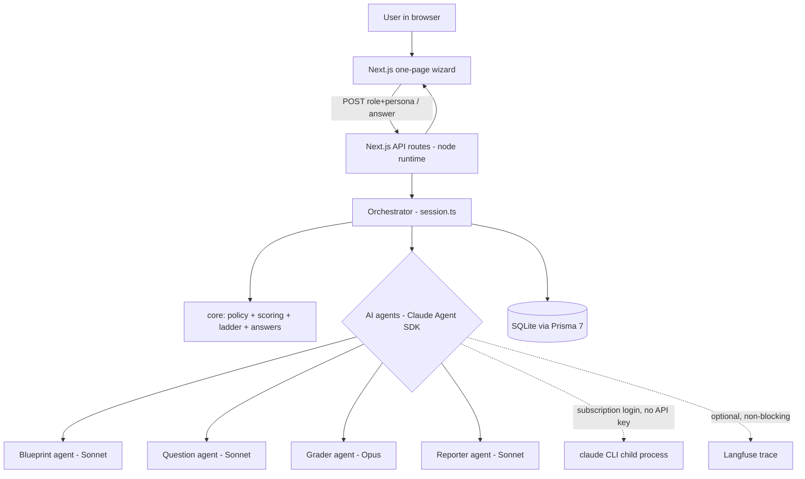

# System graph

How a request flows from the browser through the deterministic loop to the AI agents and back. The orchestrator drives a fixed order; agents never route themselves.

## The deterministic loop (owned by code, not the model)

1. **Blueprint** once: role + persona -> topics + raw weights + per-topic prior. Code normalizes weights to exactly 1000.
2. **Select topic**: highest uncertainty (sigma), tie-broken by weight.
3. **Pick difficulty**: first question in a topic uses the persona prior; after that it tracks the live estimate, with a ceiling probe one level up after a run of strong answers.
4. **Question** agent writes one question + rubric + gold reference at that difficulty.
5. User answers. Degenerate answers (empty/gibberish/too-short) score 0 in code with no grading call.
6. **Grader** agent (Opus) scores the answer against the rubric with evidence quotes.
7. Code updates the topic with a Kalman-style step using a **deterministic** confidence from matched/missing rubric points (never the model's self-reported confidence). Sigma shrinks toward a floor.
8. **Decide**: stop a topic at convergence (min 2 answers + low sigma) or its cap; stop the session when all topics converge or the global cap is hit.
9. **Reporter** agent turns the final estimates + transcript into strengths, gaps, and a learning path. Code computes the 1000-point split and confidence band.

## Data model (SQLite)

`Session` -> many `Topic` (carries theta, sigma, prior, streak, converged) -> many `Question` (rubric JSON) -> one `Answer` -> one `Evaluation`. `AbilitySnapshot` records one row per engine update to drive the level-over-time curve. Full state lives in these tables, so sessions are resumable.
