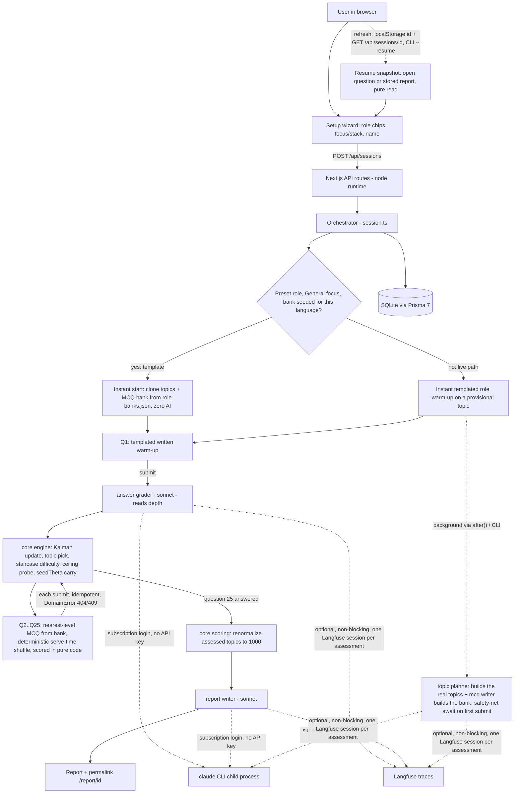

# System graph

How a session flows from the setup wizard through the deterministic engine to the AI agents and back. The orchestrator drives a fixed order; agents never route themselves. Question 1 is the only written question; everything after it is an MCQ served from a pre-generated bank with zero AI on the hot path.

## The deterministic loop (owned by code, not the model)

1. **Start**: a preset role (General focus) with a pre-seeded bank for the chosen language clones its topics + MCQ bank from `src/data/role-banks.json` instantly. A custom or specialized role, or an unseeded (role, language) pair, starts with one provisional topic and a templated role warm-up while the topic planner + MCQ bank builder run in the background (`blueprintPending`); the first submit awaits the blueprint as a safety net. Importance is normalized to exactly 1000 in code.
2. **Q1, the only written question**: a templated opener (no AI writes it). The answer is graded by the answer grader for DEPTH; a deep answer jumps the starting estimate several levels, a shallow one barely moves it. Degenerate answers (empty/gibberish/too short) score 0 in code with no grading call.
3. **Engine update**: Kalman-style step using a deterministic confidence from matched/missing rubric points (never the model's self-reported confidence). Sigma shrinks toward a floor.
4. **Topic pick**: the fixed 25-question budget is SPREAD across topics (fair share each), then leftovers go to the least-covered topic. A fresh topic opens at the running ability (`seedTheta`), never resetting to a warm-up.
5. **Q2..Q25, all MCQ**: pick the unused bank question nearest the target level, shuffle its options deterministically at serve time (keyed by session + order + stem, so always-picking-A is guess-level), persist the shuffled order, serve it. Scoring is pure code: a correct pick demonstrates a step above the item's level, a wrong pick a step below, forming an adaptive staircase. A ceiling probe asks one level up after consecutive strong answers. Bank empty = one live single-MCQ fallback.
6. **Submit is idempotent**: the answer is persisted before grading, replays return the stored result, and expected failures are typed (`DomainError` -> HTTP 404 for unknown session/question, 409 for already answered / session done).
7. **Finish**: after exactly 25 answers (never early), code renormalizes importance over ASSESSED topics only and computes the 1000-point split + confidence band. The report writer turns it into verdict, weak points, strengths/gaps, and a learning path (topic points phrased as "X of its Y points", never "X of 1000"). The report JSON persists on the session for the `/report/[id]` permalink.
8. **Resume**: full state lives in the DB, so `GET /api/sessions/[id]` (web, via a localStorage session id) or `npm run assess -- --resume <id>` (CLI) restores the exact open question or the stored report. Pure read, never generates.

## Data model (SQLite)

`Session` (role, specialization, candidateName, language, `blueprintPending`, `reportJson`) -> many `Topic` (theta, sigma, startLevel, importance, streak, converged) -> many `Question` (rubric JSON, format text|mcq, optionsJson, correctIndex kept server-side) -> one `Answer` -> one `Evaluation`. `AbilitySnapshot` records one row per engine update (level-over-time). `BankQuestion` is the pre-generated MCQ pool a session draws from (popped `used=true` when asked). Full state lives in these tables, so sessions are resumable.
